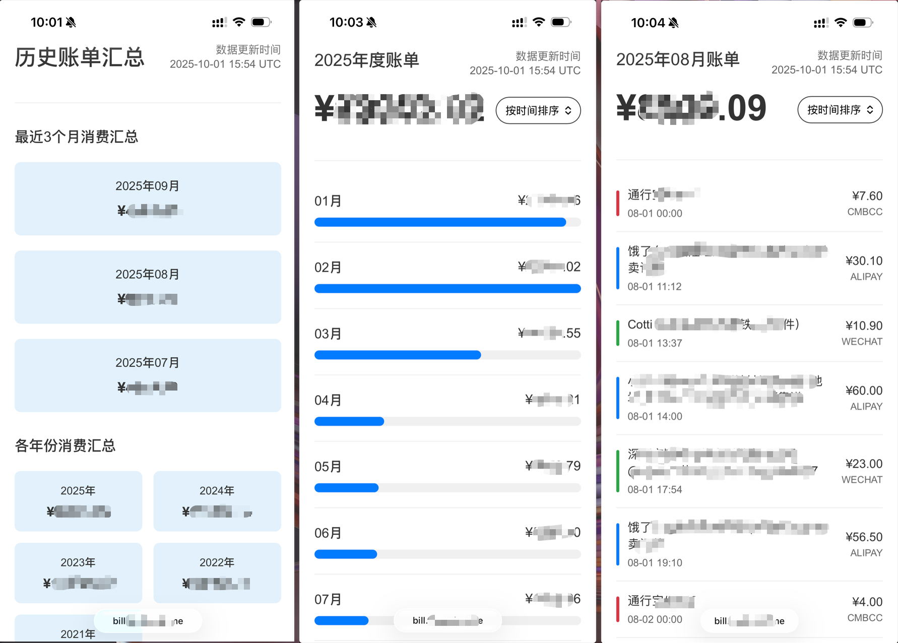

# bill-reporter

账单明细生成器

## 项目概述

本项目包含两个主要程序：
- `generate_bill_report.py`: 手动生成指定月份/年份/汇总账单的详细程序
- `main.py`: 智能账单生成主程序，自动检测并生成需要更新的账单

效果图：



---

# 账单生成主程序 (main.py)

## 功能说明

`main.py` 是一个智能账单生成程序，能够根据数据库和HTML文件的更新时间对比，自动生成需要更新的账单。

## 主要特性

1. **智能比较**: 比较数据库中 `UPDATE_TIME` 列与HTML文件的修改时间
2. **自动生成**: 只重新生成需要更新的账单，避免不必要的重复工作
3. **全面覆盖**: 支持月度账单、年度账单和汇总账单的生成
4. **灵活配置**: 支持自定义数据库文件和输出目录

## 使用方法

### 基本用法
```bash
python main.py
```

### 自定义参数
```bash
python main.py --db 数据库文件路径 --output HTML输出目录
```

### 参数说明
- `--db`: 数据库文件路径 (默认: billing.sqlite)
- `--output`: HTML账单输出目录 (默认: web)

## 工作流程

1. **查询数据库**: 获取所有年月、年份和汇总数据的最新更新时间
2. **检查月度账单**: 比较每个月的数据库更新时间与对应HTML文件修改时间
3. **检查年度账单**: 比较每年的数据库更新时间与对应年度HTML文件修改时间
4. **检查汇总账单**: 比较汇总数据的数据库更新时间与汇总HTML文件修改时间
5. **生成账单**: 只重新生成需要更新的账单文件

## 输出示例

### 无需更新时
```
正在查询数据库更新时间...
找到 57 个月的数据
找到 5 年的数据

=== 检查月度账单 ===
跳过 57 个月度账单（无需更新）

=== 检查年度账单 ===
跳过 5 个年度账单（无需更新）

=== 检查汇总账单 ===
跳过汇总账单（无需更新）

=== 完成 ===
共生成了 0 个账单文件
```

### 有需要更新时
```
正在查询数据库更新时间...
找到 57 个月的数据
找到 5 年的数据

=== 检查月度账单 ===
2025年07月需要重新生成 (数据库: 2025-09-27 10:23 UTC, HTML: 不存在)
正在生成 2025年07月账单...
总金额: ¥4614.66
月度账单已生成: web\bill_2025_07.html
跳过 56 个月度账单（无需更新）

=== 检查年度账单 ===
跳过 5 个年度账单（无需更新）

=== 检查汇总账单 ===
跳过汇总账单（无需更新）

=== 完成 ===
共生成了 1 个账单文件
```

## 文件命名规则

- 月度账单: `bill_YYYY_MM.html`
- 年度账单: `bill_YYYY_annual.html`
- 汇总账单: `bill_summary.html`
